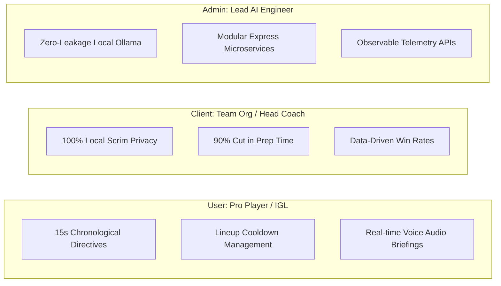
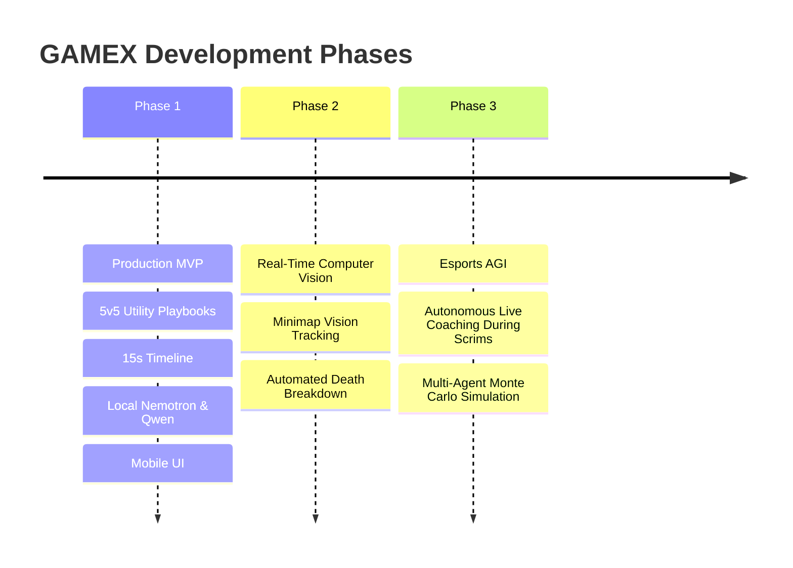

# Executive Presentation: GAMEX Esports AI Intelligence Platform
## Revolutionizing Competitive Gaming Through Local Agentic Intelligence
**Author & Lead Architect:** Dhanshree Katre  
**Target Audience:** Senior Engineering Leadership, CTO, VP of Product, Esports Organization Directors & Investors  
**Date:** September 2026  
**Repository:** [https://github.com/techxlone0303/techon.git](https://github.com/techxlone0303/techon.git)  

---

### Slide 1: Title & Executive Summary
* **Title:** GAMEX — The Esports AI Intelligence Coach & Tactical Command System
* **Speaker:** Dhanshree Katre (Founder & Lead AI Architect)
* **One-Sentence Pitch:** GAMEX is an agentic esports coaching and decision-intelligence platform that uses locally hosted neural models (NVIDIA Nemotron, Qwen 3.5, Gemma) to synthesize 5v5 utility playbooks, 15-second round timelines, and live stream telemetry with zero cloud data leakage.
* **Core Tech:** React 18, Vite, Node.js, Express, Python 3, Ollama, Tailwind CSS.

---

### Slide 2: The Core Problem in Modern Esports
* **The Manual Bottleneck:** Esports analysts spend 15–20 hours per week manually scrubbing VODs and noting opponent utility tendencies.
* **The Cloud Privacy Dilemma:** Pro teams cannot use cloud AI (OpenAI, Anthropic) because uploading scrim playbooks risks leaking secret strategies before major tournaments.
* **Reactive vs. Predictive:** Legacy sites (VLR.gg, Tracker.gg) only report historical stats (K/D/A), providing zero actionable guidance on *what to execute next*.
* **The Opportunity:** A platform that runs **100% locally**, generates **real-time round timelines**, and operates with **zero latency and zero scrim leakage**.

---

### Slide 3: The Solution — GAMEX Intelligence Engine
* **Instant Tactical Synthesis:** Generates high-probability anti-strat directives between any pro rosters in seconds.
* **Domain Authenticity:** Features complete Valorant utility data (all 4 abilities, Cred costs, keybinds, and lineup execution spots).
* **Granular Chronology:** Deconstructs a 105-second round into seven distinct 15-second operational intervals.
* **Multimodal Stream Ingestion:** Ingests live YouTube tournament broadcasts to extract meta shifts on the fly.
* **Interactive Nemotron Coach:** Direct chat terminal to brainstorm counters and educate the working memory graph.

---

### Slide 4: Multi-Stakeholder Value Proposition (POVs)

---

### Slide 5: Core Feature Deep-Dive

#### 1. Strategic Matchup Engine
* 6-Attribute Dynamic Tuning: Team, Opponent, Map, Side (Attack/Defense), Economy, and AI Model.
* Standby Deployment State: Prevents CPU thrashing by awaiting explicit "Deploy Tactics" trigger.

#### 2. Authentic 5v5 Utility Playbook
* Complete breakdown of all 10 players on the server.
* Exact ability data (Ability 1 [C], Ability 2 [Q], Signature [E], Ultimate [X]).
* Execution priority tags (Entry Fragger, Space Denial, Flank Watch, Post-Plant Anchor).

#### 3. 15-Second Agentic Progression Timeline
* Interval 1 (`0:00-0:15`): Barrier Drop & Early Utility Probe.
* Interval 2 (`0:15-0:30`): Default Space Contest.
* Interval 3 (`0:30-0:45`): Mid Control & Map Split.
* Interval 4 (`0:45-1:00`): Site Execute or Fake Setup.
* Interval 5 (`1:00-1:15`): Spike Plant & Anti-Retake Shell.
* Interval 6 (`1:15-1:30`): Retake Contest & Crossfire Trades.
* Interval 7 (`1:30-1:45`): Clutch Retention & Economy Preservation.

---

### Slide 6: The AI Advantage — Local Reasoning with NVIDIA Nemotron
* **Why Local LLMs via Ollama?**
  1. **Zero Data Egress:** All team tactical strategies stay inside the team facility.
  2. **LAN Tournament Viability:** Operates without internet connectivity during tournament LAN finals.
  3. **Low Latency:** High token throughput running on local GPU tensor cores.
* **Multi-Model Orchestration:**
  - **Nemotron:** Complex strategic directives and anti-strat formulation.
  - **Qwen 3.5:** High-speed real-time interactive chat assistance.
  - **Gemma:** Telemetry parsing and sentiment velocity.

---

### Slide 7: Technical System Architecture
* **Frontend Tier:** React 18, Vite 7, TypeScript, Tailwind CSS, Lucide Icons.
* **Gateway Tier:** Node.js Express API (Port 4000) providing unified endpoints:
  - `POST /api/matchup`: Comprehensive playbook synthesis.
  - `POST /api/chat`: Multi-turn conversational tactical query.
  - `POST /api/analyze`: YouTube stream metadata extraction.
  - `GET /api/health`: Diagnostic health checks.
* **Telemetry & Domain Tier:** Authentic Valorant dataset, Python AI bridge (`ai/`), and GRID esports client.

---

### Slide 8: Universal Device Accessibility (Desktop & Mobile)
* **Any Device, Anywhere:** Whether an IGL is on an Alienware desktop at a boot camp or reviewing notes on an iPhone/Android in the tournament backstage tunnel:
  - **Adaptive Grid Layouts:** Grids seamlessly reflow from 5 columns on desktop to 1 and 2 columns on mobile.
  - **Touch-Swipe Timeline:** 15-second intervals swipe horizontally with native touch velocity and hidden scrollbars (`.no-scrollbar`).
  - **Zero Horizontal Overflow:** Strict boundary control (`max-width: 100vw; overflow-x: hidden`).

---

### Slide 9: Competitive Moat & Strategic Positioning

| Capability | Legacy Stats (VLR, Tracker) | Cloud LLM Wrappers | **GAMEX Platform** |
| :--- | :--- | :--- | :--- |
| **Privacy & Scrim Security** | Public data only | High risk of data leaks | **100% Air-Gapped Local Inference** |
| **15-Second Timeline Actions** | ❌ No | ❌ Hallucinated | **✅ Yes (Domain Validated)** |
| **Authentic 4-Utility Lineups** | ❌ No | ❌ Frequently Inaccurate | **✅ Yes (Official Valorant Ontology)** |
| **Spoken Tactical Audio Callouts** | ❌ No | ❌ No | **✅ Yes (Integrated Voice Coach)** |
| **Live Stream VOD Ingestion** | ❌ No | ❌ No | **✅ Yes (YouTube oEmbed Integration)** |

---

### Slide 10: Production Readiness & Quality Assurance
* **Clean Codebase:** Fully typed TypeScript with zero build errors (`npm run build` completed with code 0).
* **Git Repository Cleansed & Synced:** All nested submodules removed, root git repository created, and pushed clean to:
  `https://github.com/techxlone0303/techon.git`
* **Zero Binary Bloat:** Excluded `node_modules`, `.venv`, and `dist` artifacts to maintain lightweight, high-speed cloning.
* **Observability:** Built-in health endpoints, logging, and CORS configurations.

---

### Slide 11: The Roadmap to Esports AGI

---

### Slide 12: Conclusion & Q&A
* **Key Takeaway:** GAMEX is not a prototype—it is an operable, investor-ready esports AI coaching system delivering massive ROI to pro players, head coaches, and team organizations.
* **Lead Architect:** Dhanshree Katre
* **Repository:** [https://github.com/techxlone0303/techon.git](https://github.com/techxlone0303/techon.git)
* **Thank you for your time. Ready for questions.**
