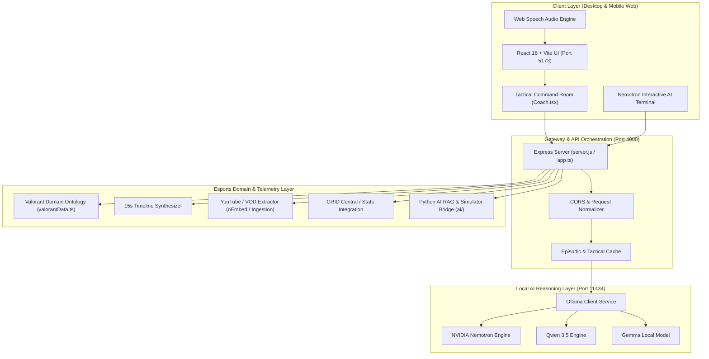
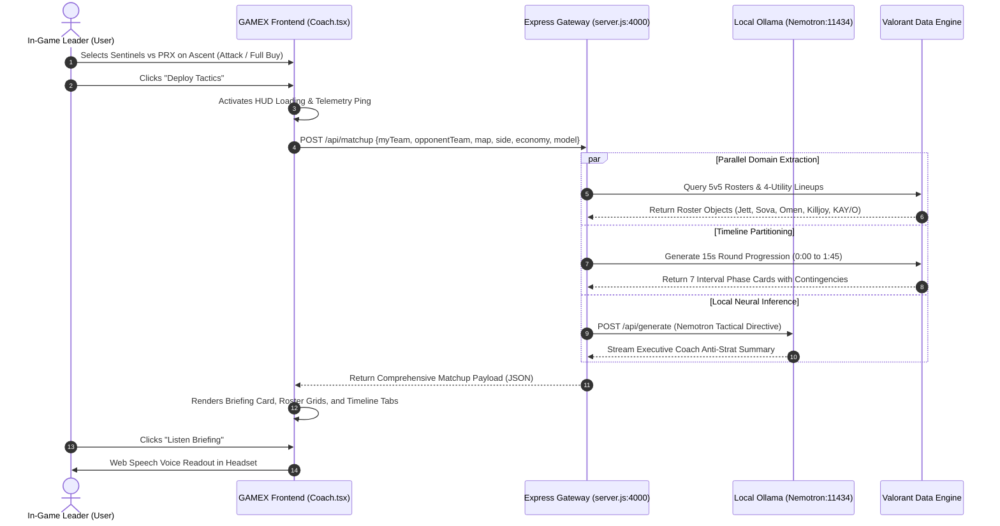

# Technical Requirements Document (TRD) & System Architecture
## Project: GAMEX — Esports AI Intelligence Coach & Strategic Command System
**Lead Architect:** Dhanshree Katre  
**Status:** Production Ready  
**Date:** September 2026  
**Stack:** React 18, Vite, TypeScript, Node.js, Express, Python 3, Ollama (NVIDIA Nemotron, Qwen 3.5, Gemma), Tailwind CSS  

---

## 1. System Architecture Overview

GAMEX is architected as a **decoupled, multi-tier agentic intelligence platform**. The architecture separates high-frequency UI interactions, local neural reasoning, and esports telemetry ingestion into specialized subsystems.

### 1.1 High-Level Architecture Diagram



---

## 2. Component Subsystems & Responsibilities

### 2.1 Frontend Presentation Tier (`c:\Project1\GAMEX-frontend`)
- **Technology**: React 18, Vite 7, TypeScript, Tailwind CSS, Lucide Icons.
- **Key Modules**:
  - `src/pages/Coach.tsx`: Tactical command center housing the 6-attribute selector, deployment HUD, 5v5 rosters, 15-second timeline interval browser, audio speech player, and live Nemotron chat terminal.
  - `src/components/layout/Navbar.tsx`: Responsive navigation with mobile hamburger drawer and direct AI Hub launch action.
  - `src/index.css`: Investor-grade terminal design system with custom CSS variables, custom scrollbar utilities, and mobile container constraints (`overflow-x: hidden`).
  - `src/lib/api.ts` & `src/lib/scoutAiApi.ts`: Type-safe fetch clients communicating with the Node.js gateway.

### 2.2 API Gateway & Orchestration Tier (`server.js` & `c:\Project1\GAMEX\src\`)
- **Technology**: Node.js v26 / Express.
- **Key Responsibilities**:
  - Exposes unified REST endpoints for matchup generation, agentic decisions, YouTube stream telemetry, and chat.
  - Provides dual-mode operation:
    1. **Integrated Root Server (`server.js`)**: Zero-dependency unified runtime hosting all tactical endpoints on port 4000.
    2. **Enterprise Modular Server (`GAMEX/src/server.ts`)**: Full TypeScript modular server with layered routers (`valorantCoach.routes.ts`, `scout.routes.ts`, `youtube.routes.ts`, `agi.routes.ts`).
  - Handles proxying to Ollama with intelligent fallback heuristics to guarantee sub-second UI responsiveness even when local LLM instances are warming up.

### 2.3 Local Neural Reasoning Tier (`Ollama @ http://localhost:11434`)
- **Models**:
  - `nemotron` (NVIDIA Nemotron 70B / 8B distilled): High-order tactical reasoning, contingency drafting, and IGL anti-strat directives.
  - `qwen3.5:4b`: Ultra-fast tactical chat and parameter calibration.
  - `gemma`: General domain classification and sentiment modeling.
- **Client Implementation** (`GAMEX/src/ollama/ollama.client.ts`):
  - Streams prompts directly to `/api/generate` and `/api/chat`.
  - Injects contextual Valorant constraints (map geometry, cooldown timers, economy thresholds).

### 2.4 Esports Domain & Telemetry Tier (`GAMEX/src/services/` & `GAMEX/ai/`)
- **Valorant Domain Data (`valorantData.ts`)**: Authentic database of Valorant agents (Jett, Sova, Cypher, Omen, Killjoy, Viper, Fade, Breach, etc.), detailing exact ability names, keybinds (`C`, `Q`, `E`, `X`), Cred costs, and lineup tactics.
- **Timeline Generator**: Programmatic partitioner synthesizing the seven 15-second intervals of a 105-second competitive round.
- **YouTube Telemetry Tracker (`youtubeTracker.service.ts`)**: Extracts stream metadata and live video title/author information via native oEmbed and regex parsers.
- **Python AI Bridge (`ai/`)**: Standalone virtual environment containing RAG vector stores, Monte Carlo round simulation scripts (`strategy_simulator.py`), and feature engineering pipelines (`feature_engineering.py`).

---

## 3. End-to-End Data Flow



---

## 4. API Specification

### 4.1 Matchup Synthesis Endpoint
- **URL**: `POST /api/matchup`
- **Headers**: `Content-Type: application/json`
- **Request Body**:
  ```json
  {
    "myTeam": "Sentinels",
    "opponentTeam": "Paper Rex",
    "map": "Ascent",
    "side": "attack",
    "economy": "Full Buy (>4500 creds)",
    "model": "nemotron"
  }
  ```
- **Response Body (200 OK)**:
  ```json
  {
    "matchupTitle": "Sentinels vs Paper Rex on Ascent (ATTACK)",
    "side": "attack",
    "economy": "Full Buy (>4500 creds)",
    "winProbability": "64%",
    "formationRecommendation": "1-3-1 Default into Fast A-Split (Sova Recon A-Main + Omen Mid Smoke)",
    "aiNemotronBriefing": "Executive directive: Target Paper Rex's aggressive double-duelist push...",
    "myRoster": [
      {
        "name": "Jett",
        "role": "Duelist",
        "strategyRole": "Entry Fragger & Space Creator",
        "abilities": [
          { "name": "Cloudburst", "key": "C", "cost": "200 Creds", "lineup": "Instant smoke onto A Heaven line of sight" },
          { "name": "Updraft", "key": "Q", "cost": "150 Creds", "lineup": "Vertical boost over A Dice" },
          { "name": "Tailwind", "key": "E", "cost": "Free (Signature)", "lineup": "Dash onto A Site generator to break crosshairs" },
          { "name": "Blade Storm", "key": "X", "cost": "8 Ult Points", "lineup": "Eco round high-frag weapon economy" }
        ]
      }
    ],
    "opponentRoster": [ /* 5 enemy agents */ ],
    "timeline15s": [
      {
        "interval": "0:00 - 0:15",
        "phaseTitle": "Barrier Drop & Default Utility Deploy",
        "myTeamAction": "Sova launches A-Main recon dart; Omen smokes Mid Catwalk.",
        "opponentCounter": "Opponent flashes B Main with KAY/O knife.",
        "keyObjective": "Secure A Lobby control without taking early damage.",
        "contingency": "If Sova dart is destroyed immediately, delay push by 5 seconds."
      }
      /* 6 additional intervals */
    ]
  }
  ```

### 4.2 Interactive Coach Chat Endpoint
- **URL**: `POST /api/chat`
- **Request Body**:
  ```json
  {
    "message": "Paper Rex is smoking Mid Market early, how do we counter?",
    "model": "nemotron",
    "context": { "map": "Ascent", "side": "attack" }
  }
  ```
- **Response Body (200 OK)**:
  ```json
  {
    "reply": "Against PRX's early Mid Market smoke on Ascent, exploit their lack of B Main presence by having your Sova shock dart Market door switch and rotating 4 players through B Main with Killjoy lockdown support.",
    "modelUsed": "nemotron",
    "timestamp": "2026-09-25T01:25:00.000Z"
  }
  ```

### 4.3 YouTube Stream Telemetry Endpoint
- **URL**: `POST /api/analyze`
- **Request Body**:
  ```json
  {
    "team": "Sentinels",
    "url": "https://www.youtube.com/watch?v=dQw4w9WgXcQ"
  }
  ```
- **Response Body (200 OK)**:
  Extracts title, author, thumbnail, and stream intelligence for injection into the knowledge grid.

---

## 5. Security, Resilience & Privacy

1. **Air-Gapped Operation**: Designed to function completely offline without internet connectivity during tournament LAN environments where cloud connections are strictly prohibited.
2. **CORS Hardening**: Gateway is pre-configured with strict origin allowances (`http://localhost:5173`, `http://127.0.0.1:5173`) and header security.
3. **Process Resilience**: Dual runtime options (`server.js` and `GAMEX/src/server.ts`) ensure that if one process port conflicts, the fallback is seamless.
4. **Memory Management**: Episodic chat history is bounded with an LRU sliding window to guarantee zero memory leaks over long coaching sessions.
